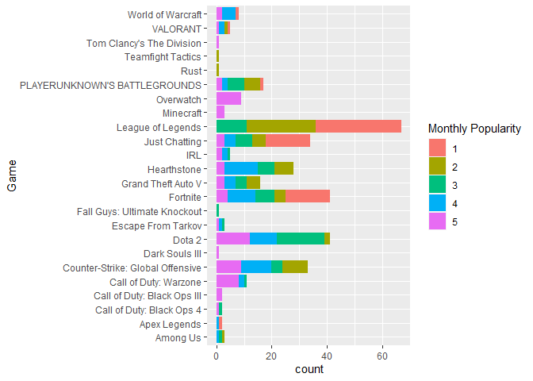

writeup
================
Kaleb Cervantes
September 19, 2021

The following code chunk loads the neccessary libraries:

``` r
library(tidyverse)
library(lubridate)
```

The next code chunk loads the game portion of the kaggle dataset.

``` r
# loads game dataset with as many variables in ideal types as possible
Twitch_game_data <- read_csv(
  "data/Twitch_game_data.csv",
  col_types = cols(
    Rank = col_integer(),
    Month = col_integer(),
    Year = col_integer(),
    Hours_watched = col_integer(), 
    Hours_Streamed = col_character(), 
    Peak_viewers = col_integer(),
    Peak_channels = col_integer(),
    Streamers = col_integer(),
    Avg_viewers = col_integer(),
    Avg_channels = col_integer()
  )
)

# converts Month variable to a date type
Twitch_game_data$Month <- (
  Twitch_game_data %>%
  select(Year, Month) %>%
  transmute(Month = make_date(year=Year, month=Month))
)$Month

# remove Year variable
Twitch_game_data <- within(Twitch_game_data, rm(Year))

# changes Hours_Streamed from char to integer
Twitch_game_data$Hours_Streamed <- sapply(
  
  #remove non numeric characters
  sub(" hours", "", Twitch_game_data$Hours_Streamed),
  
  as.integer
)
```

I was asked by someone in a Discord server about what games were in the
top 5 popularity for Twitch. To do this, I decided to subset the game
data and visualize with a barplot.

``` r
# filters out top 5 for each month
top5 <- subset(Twitch_game_data, Rank <= 5)

# bar plot
ggplot(top5) +
  geom_bar(aes(x=Game, fill=factor(Rank))) + # factor is needed or else color will be grey
  labs(fill="Monthly Popularity") + # more understandable
  coord_flip() # more visible on laptop
```

<!-- -->

We can also load in a data set that contains some global data to get a
better idea of how relatively popular these categories are.

``` r
# loads global dataset with as many variables in ideal types as possible
Twitch_global_data <- read_csv(
  "data/Twitch_global_data.csv",
  col_types = cols(
    year = col_integer(),
    Month = col_integer(),
    Hours_watched = col_number(),
    Avg_viewers = col_integer(),
    Peak_viewers = col_integer(),
    Streams = col_integer(),
    Avg_channels = col_integer()
  )
)

# converts Month variable to a date type
Twitch_global_data$Month <- (
  Twitch_global_data %>%
    select(year, Month) %>%
    transmute(Month = make_date(year=year, month=Month))
)$Month

# remove Year variable
Twitch_global_data <- within(Twitch_global_data, rm(year))

# converts string column to integer
Twitch_global_data$Games_streamed <- sapply(
  
  # removes comma from string
  sub(",", "", Twitch_global_data$Games_streamed),
  
  as.integer
)
```
