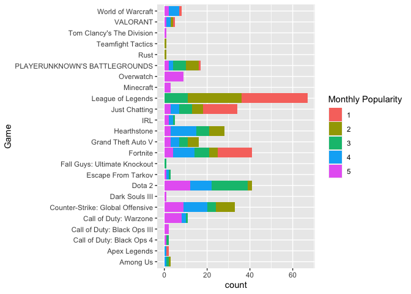
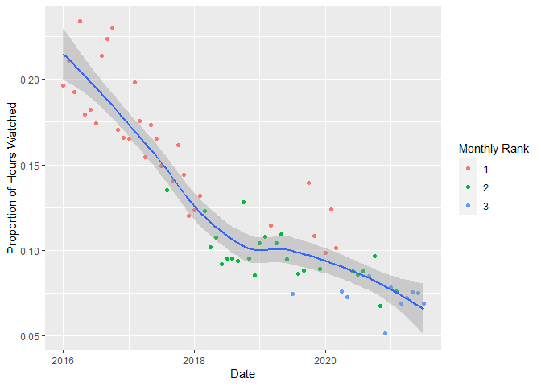

writeup
================
Kaleb Cervantes
September 19, 2021

The following code chunk loads the neccessary libraries:

``` r
library(tidyverse)
library(lubridate)
```

The next code chunk loads the game portion of the kaggle dataset.

``` r
# loads game dataset with as many variables in ideal types as possible
Twitch_game_data <- read_csv(
  "data/Twitch_game_data.csv",
  col_types = cols(
    Rank = col_integer(),
    Month = col_integer(),
    Year = col_integer(),
    Hours_watched = col_integer(), 
    Hours_Streamed = col_character(), 
    Peak_viewers = col_integer(),
    Peak_channels = col_integer(),
    Streamers = col_integer(),
    Avg_viewers = col_integer(),
    Avg_channels = col_integer()
  )
)

# converts Month variable to a date type
Twitch_game_data$Month <- (
  Twitch_game_data %>%
  select(Year, Month) %>%
  transmute(tmp = make_date(year=Year, month=Month))
)$tmp

# remove Year variable
Twitch_game_data <- within(Twitch_game_data, rm(Year))

# changes Hours_Streamed from char to integer
Twitch_game_data$Hours_Streamed <- sapply(
  
  #remove non numeric characters
  sub(" hours", "", Twitch_game_data$Hours_Streamed),
  
  as.integer
)
```

We can also load in a data set that contains some global data to get a
better idea of how relatively popular these categories are.

``` r
# loads global dataset with as many variables in ideal types as possible
Twitch_global_data <- read_csv(
  "data/Twitch_global_data.csv",
  col_types = cols(
    year = col_integer(),
    Month = col_integer(),
    Hours_watched = col_number(),
    Avg_viewers = col_integer(),
    Peak_viewers = col_integer(),
    Streams = col_integer(),
    Avg_channels = col_integer()
  )
)

# converts Month variable to a date type
Twitch_global_data$Month <- (
  Twitch_global_data %>%
    select(year, Month) %>%
    transmute(tmp = make_date(year=year, month=Month))
)$tmp

# remove Year variable
Twitch_global_data <- within(Twitch_global_data, rm(year))

# converts string column to integer
Twitch_global_data$Games_streamed <- sapply(
  
  # removes comma from string
  sub(",", "", Twitch_global_data$Games_streamed),
  
  as.integer
)
```

In order to get an idea about the relative popularity of each game, I
decided to add a column that gives the ratio of hours watched views for
the game over the site.

``` r
Twitch_game_data$ratio_hours_watched <- (
  
  # subset game data
  Twitch_game_data %>%
    select(Rank, Month, Hours_watched) %>%
    merge(
      
      # subset global data
      Twitch_global_data %>%
        select(Month, Hours_watched),
      
      # inner join by month
      by = "Month",
      
      # rename variables to avoid ambiguity
      suffixes = c("_game", "_global")
    ) %>%
    
    # create temporary column
    transmute(tmp = Hours_watched_game / Hours_watched_global)
  
  # extract temporary column
)$tmp
```

I was asked by someone in a Discord server about what games were in the
top 5 popularity for Twitch. To do this, I decided to subset the game
data and visualize with a barplot.

``` r
# filters out top 5 for each month
top5 <- subset(Twitch_game_data, Rank <= 5)

# bar plot
ggplot(top5) +
  
  # factor is needed or else color will be grey
  geom_bar(aes(x=Game, fill=factor(Rank))) +
  labs(fill="Monthly Popularity") +
  
  # more visible on laptop
  coord_flip()
```

<!-- -->

## *League of Legends*

From the bar graph, we can see that *League of Legends* has been one of
the most consistently popular games on the site.

``` r
lol_data <- Twitch_game_data %>%
  subset(Game == "League of Legends")
```

Now that we have the subset of the data, we can observe how of the
metrics have changed over time.

Observing the unique values of the `Monthly Rank` variable, we can see
that *League of Legends* has consistently been one of the three most
popular games on the site since January 2016.

Despite remaining in the top 3, we can see that both the monthly rank
and proportion of hours watched have steadily decreased over time.

``` r
ggplot(lol_data, mapping = aes(x = Month, y = ratio_hours_watched)) +
  geom_point(mapping = aes(color = factor(Rank))) +
  geom_smooth() +
  labs(y = "Proportion of Hours Watched", color = "Monthly Rank")
```

    ## `geom_smooth()` using method = 'loess' and formula 'y ~ x'

<!-- -->
